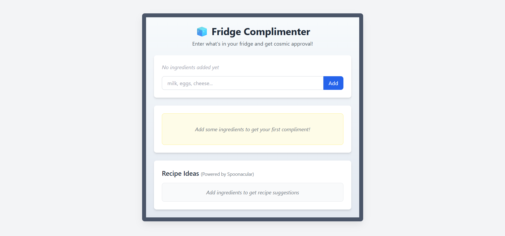

# Fridge Complimenter 🎯

## Basic Details
### Team Name: Chaya

### Team Members
- Team Lead: Ajil P R - ICCS College of Engineering & Management
- Member 2: Abhi Paul

### Project Description
Fridge Complimenter is a playful web app that gives users funny, clever, and wholesome compliments based on the food items they have in their fridge or pantry. Simply type in what’s in your fridge, and the app uses a mix of logic and AI to generate a compliment that makes you feel like a culinary genius (or at least a smart shopper)

### The Problem (that doesn't exist)
The Problem is the confusion of getting concerned about what to make for food with limited ingredients.

### The Solution (that nobody asked for)
You can use the webpage and get the recepies anf have fun......

## Technical Details
### Technologies/Components Used
For Software:
- Html,Css,Js
- Spoonacular API
- Vs Code

### Project Documentation
For Software:

# Screenshots

exp1.png
exp2.png

# Schematic & Circuit

*Add caption explaining connections*

*Add caption explaining the schematic*

# Build Photos

https://drive.google.com/file/d/1WxZsKOQXn6dLBk9YzqkoisCxaeq_eVZ9/view?usp=sharing

https://drive.google.com/file/d/14ETGfvt4vQfUU_K6kaD1tIQjVl09c2CN/view?usp=sharing

## Team Contributions
- Abhi Paul
- Ajil P R
---
Made with ❤️ at TinkerHub Useless Projects 

